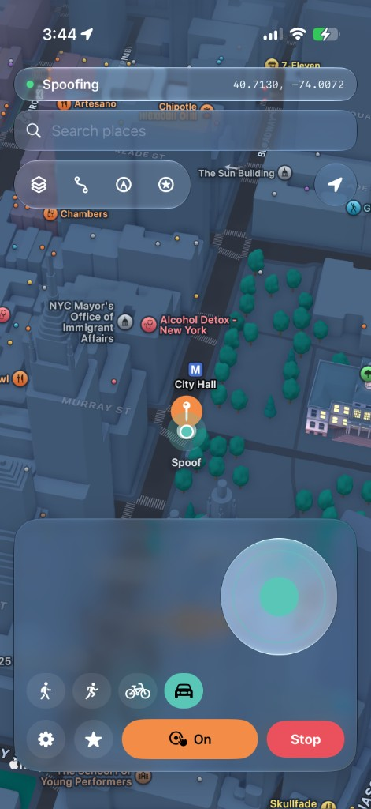

# Locus

Free and open-source iPhone location teleport. Tap the map, search a place, or drive a route — Locus injects coordinates through Apple’s **developer location service** into `locationd`, so Maps and other apps see the spoofed GPS (not just a Wi‑Fi lookup that outdoor GPS will overwrite).

<p align="center">
  
  
  
  
</p>

## Features

- One-tap teleport (map pin or place search)
- Live joystick — walk / run / cycle / drive with light speed variation
- Walk/Drive routing on real roads & footpaths (MapKit)
- Draw a path or import / export GPX
- Background keep-alive + live status bar + drop alerts
- Favorites & recents
- First-run setup walkthrough
- Fully on-device — no analytics, nothing uploaded

## Install

See [SETUP.md](SETUP.md). Grab a prebuilt IPA from [Releases](https://github.com/ChrisMack32/Locus/releases), or build from source below.

Bundle ID: `com.chrismack.locus`

## How it works

Locus uses the MIT-licensed [idevice](https://github.com/jkcoxson/idevice) FFI to talk to Apple’s DVT location simulation over an on-device developer tunnel (the same class of mechanism Xcode uses).

**iOS 27:** Settings → **Pair on this iPhone** advertises `_remotepairing-pairable-host._tcp`. Confirm the 6-digit code under Settings › Privacy & Security › Developer Mode › Pair with Host — no computer.

**iOS 18–26:** import an **RPPairing** file once from [idevice_pair](https://github.com/jkcoxson/idevice_pair/releases).

Also install **[LocalDevVPN](https://apps.apple.com/us/app/localdevvpn/id6755608044)** (loopback tunnel, default `10.7.0.1`), then sideload Locus.

Start a teleport on Wi‑Fi first; the session can keep working on cellular afterward.

## Build

```bash
xcodegen generate
open Locus.xcodeproj
```

Or:

```bash
xcodebuild -project Locus.xcodeproj -scheme Locus -configuration Release \
  -destination 'generic/platform=iOS' DEVELOPMENT_TEAM=YOUR_TEAM_ID build
```

## License

MIT. `Vendor/idevice` contains the idevice FFI (MIT). Locus is an independent open-source project and is not affiliated with Mirage / Wapixel.
